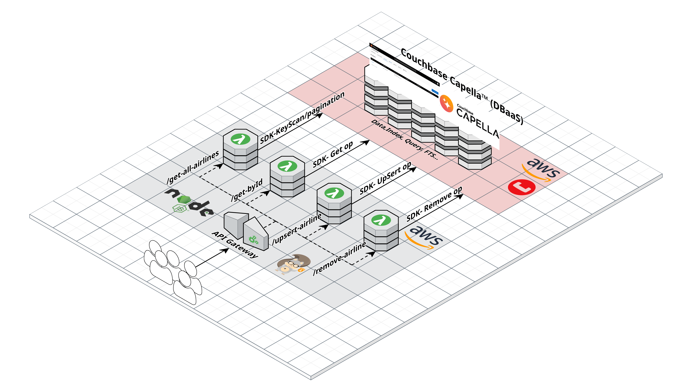
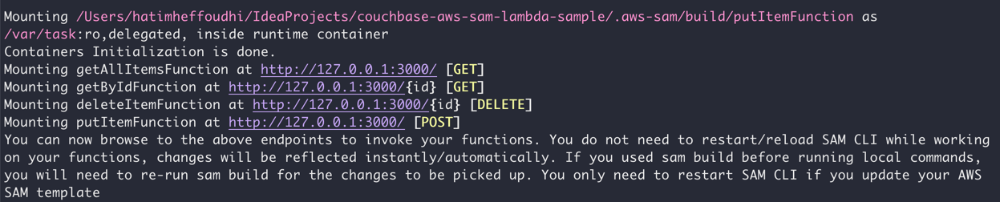
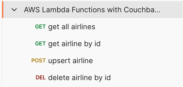

# Couchbase AWS SAM Lambda Sample

This repository provides a sample integration between [Couchbase](https://www.couchbase.com/)
, [AWS SAM (Serverless Application Model)](https://aws.amazon.com/serverless/sam/), and AWS Lambda. It demonstrates how
to deploy and interact with Couchbase Capella from an AWS Lambda function using AWS SAM.

Additionally, the application is fully configurable **to run locally**, allowing for **local testing** and development
using the AWS SAM CLI. This provides a convenient environment for developers to test Lambda functions and Couchbase
integration without needing to deploy to AWS.

## Table of Contents

- [Overview](#overview)
- [Architecture](#architecture)
- [Prerequisites](#prerequisites)
- [Setup and Deployment](#setup-and-deployment)
- [Usage](#usage)
- [Troubleshooting](#troubleshooting)
- [Contributing](#contributing)
- [License](#license)

---

## Overview

This project enables seamless interaction between AWS Lambda and Couchbase by leveraging AWS SAM for deploying a
serverless application. The sample setup connects Lambda functions to a Couchbase database, demonstrating data
operations with Couchbase within a Lambda environment.

## Architecture

The application architecture consists of:

- **API Gateway** - Acts as the entry point to the serverless application, routing HTTP requests to AWS Lambda
  functions.
- **AWS Lambda** - Executes code in response to triggers, accessing Couchbase Capella
- **Couchbase Capella Database** - Couchbase’s cloud database platform that optimizes data storage and processing for
  both
  JSON-native operational and analytical data. A faster, better DBaaS for transaction, search, AI, and edge
  applications, with real-time analytics.
- **AWS SAM** - Provides an infrastructure-as-code template to define, configure, and deploy the entire serverless
  application stack.



## Prerequisites

To run this sample, you will need:

- [Docker](https://docs.docker.com/engine/install/) installed and configured
- [AWS CLI](https://aws.amazon.com/cli/) installed and configured
- [AWS SAM CLI](https://docs.aws.amazon.com/serverless-application-model/latest/developerguide/what-is-sam.html)
  installed
- [Couchbase Capella](https://www.couchbase.com/products/capella/) account with access to a Free Tier cluster for a
  managed Couchbase instance. [Sign up for Couchbase Capella](https://cloud.couchbase.com/sign-in).

## Setup and Deployment

### Step 1: Clone the Repository

Clone the repository to your local machine:

```bash
git clone https://github.com/hatim-heffoudhi/couchbase-aws-sam-lambda-sample.git
cd couchbase-aws-sam-lambda-sample
```

### Step 2: Install Dependencies

Install all necessary dependencies required for the project:

```bash
npm install
```

### Step 3: Build the SAM Application

To build the serverless application using AWS SAM, run the following command:

```bash
npm run build
```

### Step 4: Start the Local API (Optional)

For local testing, you can start the local API Gateway using AWS SAM:

```bash
npm run start
```

This will start the API locally, and run 4 docker containers, you can make requests to it using localhost on your
machine.


### Step 6: Import the Postman Collection and test the API

To test your API with Postman, follow these steps:

1. Download or Import the Postman Collection located in postman-collection/:
2. Open Postman:
3. Import the Collection:
   - In Postman, go to **File > Import** in the top menu.
   - Choose the collection file or paste the collection's link to import it.
4. **Start Using the APIs



Example of get All Airlines


